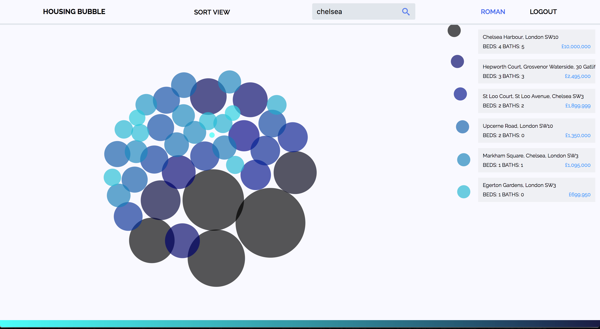

### GA WDI London - Project 4, Housing Bubble

Housing Bubble is a property finding application that is built with D3.js, AngularJS and Ruby on Rails.

Houses are represented as SVG bubbles of different sizes and colours relative to the their listed value on Zoopla.

#### [View it here!][url_id]
[url_id]: https://housingbubble.herokuapp.com



### Functionality:

Users can search for any location in England by Street name, Post code, Town, City or Area.

The user can log in, add and remove houses to and from their housing portfolio and then view the house listed on Zoopla by clicking on the houses grey info box.

Users can also sort houses by the number of Bedrooms and Bathrooms.

There is a colour key that pops up when the footer is hovered over.

### The Build

D3.js, AngularJS, HTML, SCSS, Ruby on Rails, Gulp.js, Git.


### To Use this Angular Gulp Setup

If you have forked this code, to get setup, you first need to run:

```sh
$ bower install && gulp install
```
